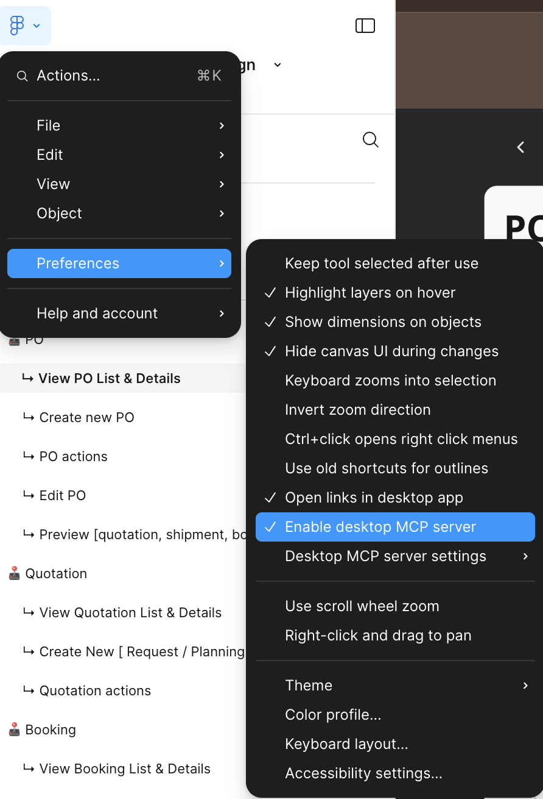
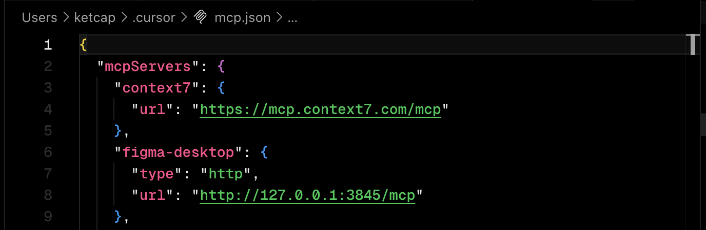

# Cursor for Designers

Design Workshop


---
layout: quote
---

## Welcome and Framing

---

### Why Cursor for Designers?

<v-clicks>

- **Faster iteration**: Build and test ideas quickly
- **Tighter design–code loop**: See changes in real-time
- **Bridge the gap**: Understand how your designs come to life

</v-clicks>

---

### What "Good" Looks Like

By the end of this session, you'll have:

<div class="text-2xl font-bold my-8">
A clickable, data-driven prototype
</div>

<v-clicks>

- Not just mockups
- Interactive and functional
- Ready to test and iterate

</v-clicks>

---
layout: quote
---

## Quick Git

Version Control Fundamentals

---

### What is Git?

Version control for your work

<v-clicks>

- **Checkpoints**: Save your progress at any point
- **Time travel**: Go back to any previous version
- **Parallel work**: Try different ideas simultaneously

</v-clicks>

---

### Why Git Matters for Designers

Think of it as:

<v-clicks>

- Multiple artboards, but for code
- Infinite undo with labels
- A safety net for experimentation

</v-clicks>

---

### Diverge and Converge

Git enables experimentation without risk

<v-clicks>

- **Run two visual approaches in parallel**
- **Snapshot key versions** as you iterate
- **Compare and choose** the best direction
- **Merge or revert** with confidence

</v-clicks>

---
layout: quote
---

## Exercise: Git Branching

Let's practice together:

<v-clicks>

1. **Create an alternative branch**
2. **Apply a different layout or style system**
3. **Compare** the two versions

</v-clicks>

---
layout: quote
---

## Cursor Setup

Core Features & Interaction Modes

---

### Three Ways to Interact with Cursor

<v-clicks>

1. **Prompts** - Conversational AI assistance
2. **Commands** - Quick keyboard shortcuts
3. **Modes** - Different AI contexts for your workflow

</v-clicks>

---

### Prompts

Chat interface for conversational AI assistance

<v-clicks>

- Ask questions about your code or design
- Request explanations of existing functionality
- Get suggestions for improvements
- **Best for:** exploratory questions and learning

</v-clicks>

---

### Commands

Quick actions triggered with keyboard shortcuts

<v-clicks>

- `Cmd+K` - Inline editing (modify selected code directly)
- `Cmd+L` - Open chat panel for broader discussions
- Custom commands for repetitive tasks
- **Best for:** rapid iteration and common tasks

</v-clicks>

---

### Modes Overview

Different AI interaction contexts that change how Cursor works

<v-clicks>

- **Agent** - Autonomous multi-step work
- **Plan** - Structured, reviewable planning before execution
- **Ask** - Q&A focused on understanding
- **Background Agent** - Remote parallel tasks

</v-clicks>

---

### Agent Mode

Autonomous, multi-step work across files

<v-clicks>

- Plans changes and traverses the codebase
- Applies coordinated edits for features or fixes
- **Best for:** multi-file changes, large refactors
- **Tip:** Keep instructions outcome-focused with clear constraints

</v-clicks>

---

### Plan Mode

Creates structured, editable plan before making changes

<v-clicks>

- Researches your codebase and asks questions
- Outputs reviewable Markdown plan
- You can edit the plan before execution
- **Best for:** complex tasks needing alignment up front
- **Shortcut:** `Shift + Tab` to start planning

</v-clicks>

---

### Ask Mode

Conversational Q&A without immediate edits

<v-clicks>

- Great for "what, where, why" questions
- Reading files and getting explanations
- Drafting examples before changing code
- **Best for:** exploring unfamiliar repos
- **Shortcut:** `Cmd/Ctrl + L` to open chat

</v-clicks>

---

### Background Agent

Remote parallel tasks without using your local environment

<v-clicks>

- Runs tasks remotely in parallel
- Can open PRs automatically
- **Best for:** batch chores or exploratory spikes
- Keeps your local environment free

</v-clicks>

---
layout: quote
---

## Exercise: Explore Modes

Let's practice:

<v-clicks>

1. Use **Ask** to map files for a design token rename
2. Switch to **Plan** to review the generated Markdown
3. Run **Agent** to execute the changes

</v-clicks>

---
layout: quote
---

## Figma MCP

Model Context Protocol for Design Systems

---

### What is MCP?

Model Context Protocol connects AI to any tool. It provides capabilities to the AI to do certain tasks. 

<v-click>
What we will be working with:
</v-click>


<v-clicks>

- Figma MCP
  - Direct access to Figma files and design tokens
  - Structured data instead of visual parsing
  - **Bridge between design and code**

</v-clicks>

<v-clicks>

- **Components** - Reusable design patterns
- **Design tokens** - Colors, spacing, typography
- **Text styles** - Typography hierarchy
- **Structure** - Layout and hierarchy information

</v-clicks>


---

### Best Practices for Figma

Set up your files for better export fidelity

<v-clicks>

- Name layers and frames consistently
- Use components and variants properly
- Organize with clear hierarchy
- Define and apply design tokens
- **Clean structure = Better AI understanding**

</v-clicks>

---
layout: quote
---

## From Design to Prototype

Two Approaches: Screenshots vs MCP

---

### Two Paths to Prototyping

<v-clicks>

1. **Screenshot approach** - Visual inference
2. **Figma MCP** - Structured data access

Both have their place in your workflow

</v-clicks>

---

### Screenshot Approach

AI infers structure from visual information

<v-clicks>

- Upload design screenshots to Cursor
- AI analyzes visual hierarchy and layout
- You enforce naming conventions and constraints
- **Best for:** quick mockups, external designs, early exploration

</v-clicks>

---

### Figma MCP Approach

Direct access to structured design data

<v-clicks>

- Connect to Figma files via MCP
- Access components, tokens, and styles
- Maintain design system consistency
- **Best for:** production-ready code*, design system work, accurate implementation

</v-clicks>

<v-click>

*: Production ready for prototyping and can be used by engineer more easily.

</v-click>

---

### Let's Enable Figma MCP

<div class="grid grid-cols-2 gap-4">
  <div>
    
  </div>
  <div>
    
  </div>
</div>

<!--
json
```
"figma-desktop": {
  "type": "http",
  "url": "http://127.0.0.1:3845/mcp"
}
```
-->


---

### Screenshot vs MCP

<div class="grid grid-cols-2 gap-8">

<div v-click>

**Screenshot**
- Faster to start
- Works with any source
- Requires more guidance
- Visual approximation

</div>

<div v-click>

**MCP**
- More accurate output
- Design system aligned
- Component-level access
- Token precision

</div>

</div>

---
layout: quote
---

## Exercise: Build a Screen

Let's implement a real design

<v-clicks>

1. Choose your approach (screenshot or MCP)
2. Implement one critical screen as a component/page
3. Add navigation and simple state interaction

**Deliverable:** Running prototype for one critical screen

</v-clicks>

